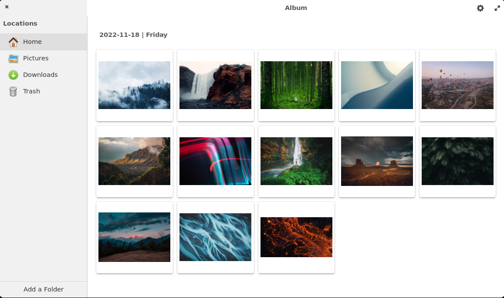

<div>
    <h1 align="center">Litrato</h1>
    <h3 align="center">View your photos in a modern way.</h3>
</div>



<br>
Litrato is a photo gallery and viewer built using Vala, Gtk and Libadwaita.

## Install from source using meson
You can install Litrato by compiling it from source, here's a list of required dependencies:
 - `elementary-sdk`
 - `gtk4>=4.9`
 - `granite-7`
 - `glib-2.0`
 - `gobject-2.0`
 - `libadwaita-1`
 - `meson`

<i>For non-elementary distros, (such as Arch, Debian, etc) you are required to install "vala" as additional dependency.</i>

Clone repository and change directory
```
git clone https://github.com/treeppenwitz/litrato.git
cd litrato
```

Compile, install and start Litrato on your system
```
meson _build --prefix=/usr
ninja -C _build install
com.github.treppenwitz.litrato
```

## Discussions
If you want to ask any questions or provide feedback, you can make issues in this repository

## Contributing
Feel free to send pull requests to this repository with your code.


<br>
<sup><b>License</b>: GNU GPLv3</sup>
<br>
<sup>© Copyright 2022 Treppenwitz</sup>
